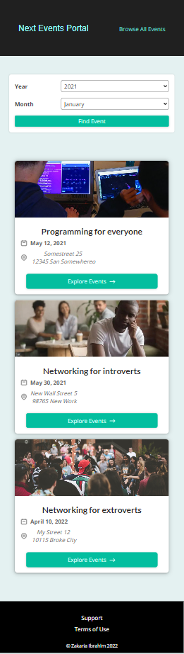

This project is a comprehensive approach to implement Next.js for a basic events portal website based on ReactJS library. This is my first React/Next.js project to practice all great features of Next.js in the React eco-system like file/folder base routing, static generation and server-side rendering data from backend, client-side data fetching, API routing for Next.js app and so on.
  
Live URL: [next-events-portal.netlify.app](https://next-events-portal.netlify.app/)
  
#Home page - desktop view:
  

  
#All events page - desktop view:
  

  
#All events page - mobile view:
  

  
#Event detail page - desktop view:
  

  
#Event detail page - mobile view:
  

  
#Filtered event page - desktop view:
  

  